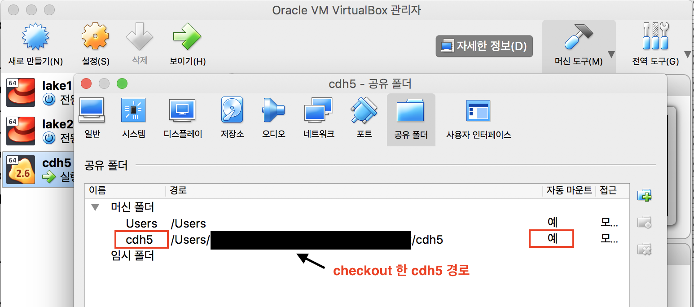

# CDH5
`forked from tilakpatidar/cdh5`  
`MacOS 환경기준`  

Docker Image for CDH5
---

[toc]

### 지원 Service
* DNS
* Zookeeper
* HDFS
* MapReduce History
* Yarn Resource Manager
* Hive 2 (w/ Metastore(MySQL))
* Oozie
* Hue
* MongoDB
* ElasticSearch (w/ Kibana)
* Kafka

### Web UI
* HDFS NN: http://hdfsnamenode.cdh5-local:50070
* MR Historty: http://mapreducehistory.cdh5-local:19888
* YARN RM: http://yarnresourcemanager.cdh5-local:8088
* Hive 2: http://hiveserver.cdh5-local:10002
* Oozie: http://oozie.cdh5-local:11000
* Hue: http://hue.cdh5-local:8888
* MongoDB: http://mongodb.cdh5-local:28017
* ElasticSearch: http://es.cdh5-local:9200
* Kibana: http://es.cdh5-local:5601

### Requirements
* Docker (https://www.docker.com/get-started)
* VirtualBox (https://www.virtualbox.org)
* Brew
	* hadoop, hive 설치용 (https://brew.sh/index_ko)
* Make
	* build 등

### 사용법
```
$> make help
Targets
 common:
   help (default)

 docker-machine:
   create remove create-network remove-network start stop ssh env-init

 docker images:
   build-all build-base build-[SERVICE_NAME]

 docker-compose:
   status remove-volume
   hdfs-up hdfs-down hdfs-start hdfs-stop
   hive-up hive-down hive-start hive-stop
   oggre-up oggre-down oggre-start oggre-stop
   mongodb-up mongodb-down mongodb-start mongodb-stop
   es-up es-down es-start es-stop

 test:
   test-all test-mr test-hive test-oozie test-sqoop test-mongodb test-es

Environment
   DOCKER_MACHINE_NAME=cdh5
```

### 시작하기
#### docker machine 이미지 생성 (`한번만 하면 됨!!`)
* 8G 메모리(VIRTUALBOX_MEMORY=8000)를 갖는 docker machine 이미지(VirtualBox) 생성

```
$> make create # DOCKER_MACHINE_NAME=cdh5 로 생성
```

#### 생성한 docker machine 이미지에 공유 폴더 설정


#### 생성한 docker machine 실행
```
$> make start
```

#### 생성한 docker machine 환경 설정 (`한번만 하면 됨!!`)
* `make start 이후에 해야함!!`

```
$> make env-init
```

#### 생성한 docker machine 에 docker image 만들기
* `make start 이후에 해야함!!`

```
$> make build-all
```

#### 본인에게 필요한 docker-compose 실행
```
$> make hdfs-up # for HDFS, MR, Yarn, Hue
OR
$> make hive-up # for hdfs-up + Hive
OR
$> make oggre-up # for hive-up + Oozie, MongoDB, ElasticSearch
```

#### docker-compose 실행후 환경 설정 필요
* hue 는 초기 한번 SQLite3 -> MySQL 로 DB Migration 이 진행되며, Migration 완료후 conf/conf.hue/migration-done 생성됨. (hue/migration.sh 참조)
* hue 초기화 방법
	* MySQL 에서 hue database drop 및 재생성 (hive-metastore/mysql-init.sql 참조)
	* migration-done 파일 삭제후 hue 재기동

```
# oggre-up 일 경우
## /etc/hosts 편집
192.168.99.100 hdfsnamenode.cdh5-local hiveserver.cdh5-local hivemetastore.cdh5-local yarnresourcemanager.cdh5-local mapreducehistory.cdh5-local hue.cdh5-local clusternode.cdh5-local oozie.cdh5-local mongodb.cdh5-local es.cdh5-local

## ~/.bashrc 편집
export HADOOP_CONF_DIR=${CDH5 절대경로}/conf/cluster-conf
export HADOOP_USER_NAME=${hdfs 에서 사용할 USER NAME}
export OOZIE_CLIENT_OPTS=-Duser.name=${oozie 에서 사용할 USER NAME}

## docker machine 의 vm.max_map_count 설정 변경 (for ElasticSearch)
$> sudo sysctl -w vm.max_map_count=262144 # make ssh 로 접속 후
```

#### 로컬 Client 설치
* `hadoop, hive 는 brew 필요!!`

##### hadoop 2.8.0
```
$> cd appendix/brew-pkg
$> brew install hadoop.rb
```

##### hive 1.1.0
```
$> cd appendix/brew-pkg
$> brew install hive.rb
```

##### mongodb 2.4.9
```
$> cd appendix/mongodb
$> ./mongo_client_install.sh
```

##### oozie 4.1.0
```
$> cd appendix/oozie
$> ./oozie_client_install.sh
```

##### sqoop 1.4.7
```
$> cd appendix/sqoop
$> ./sqoop_install.sh
```

#### Test
* sqoop 은 테스트를 위해서 MySQL 에 sqoop test 용 계정 및 Database 및 Table 생성 필요
	* test/sqoop/sqoop.sql 참조

```
$> make test-all # 혹은 개별 테스트 ex) make test-mr
```

#### 기타 명령어
```
$> make ssh # 실행한 docker machine 에 ssh 접속
$> make stop # 실행한 docker machine 중지
$> make hdfs-down # 실행한 docker-compose 종료. ex) make hdfs-up 일 경우
$> make hdfs-stop # 실행한 docker-compose 중지
$> make hdfs-start # 중지한 docker-compose 재시작
$> make remove # 생성한 docker machine 이미지 삭제. 왠만해서는 실행할 일 없음!!
```

### Trouble Shooting Guide
#### make test-mongodb 실패
* 에러 메시지

```
Thu Feb  7 14:01:31.087 Error: 18 { code: 18, ok: 0.0, errmsg: "auth fails" } at src/mongo/shell/db.js:228
exception: login failed
```
* 원인
	* mongodb docker 실행시 mongodb-init.sh 가 안되어서 인증 에러 발생 (mongodb/start.sh 참조)
* 조치
	* 해당 docker 접속해서 수동으로 mongodb-init.sh 실행

```
$> make ssh # docker machine 에 ssh 접속
$> docker_mongodb # alias docker_mongodb='docker exec -it cdh5_mongodb_1 /bin/bash'
$> /root/mongodb-init.sh # 한번만 해주면 됨!!
```

### 기타
#### 계정정보
* docker (base/Dockerfile 참조)

| ID  | PASSWORD    |
|:----|:------------|
|root |secretpasswd |

* MySQL (hive-metastore/mysql-init.sql, test/sqoop/sqoop.sql 참조)

| Database | ID   | PASSWORD  |
|:---------|:-----|:----------|
|          |root  |rootpasswd |
|hue       |hue   |huepasswd  |
|oozie     |oozie |ooziepasswd|
|sqoop     |sqoop |sqooppasswd|

* MongoDB (mongodb/files/mongodb-init.sh, test/mongodb/mongodb.sh 참조)

| Database | ID   | PASSWORD  |
|:---------|:-----|:----------|
|admin     |admin |adminpasswd|
|test      |test  |testpasswd |

#### 외부 Client 에서 docker machine 연결을 위한 방법
##### docker machine
* VirtualBox 이미지에 Port Forwarding 적용
```
$> appendix/virtualbox_nat_port_forwarding.sh
```

##### 외부 Client
* hdfs-site.xml 에 dfs.client.use.datanode.hostname 적용
```
  <!-- for connect in remote -->
  <property>
    <name>dfs.client.use.datanode.hostname</name>
    <value>true</value>
  </property>
```
* mapred-site.xml 에 yarn.app.mapreduce.am.job.client.port-range 적용
```
  <!-- for connect by hostname in remote -->
  <property>
    <name>yarn.app.mapreduce.am.job.client.port-range</name>
    <value>50200-50210</value>
  </property>
```
* /etc/hosts 에 clusternode 추가 (예: 192.168.1.5)
```
192.168.1.5 hdfsnamenode.cdh5-local hiveserver.cdh5-local hivemetastore.cdh5-local yarnresourcemanager.cdh5-local mapreducehistory.cdh5-local hue.cdh5-local clusternode.cdh5-local oozie.cdh5-local mongodb.cdh5-local es.cdh5-local
192.168.1.5 clusternode
```
